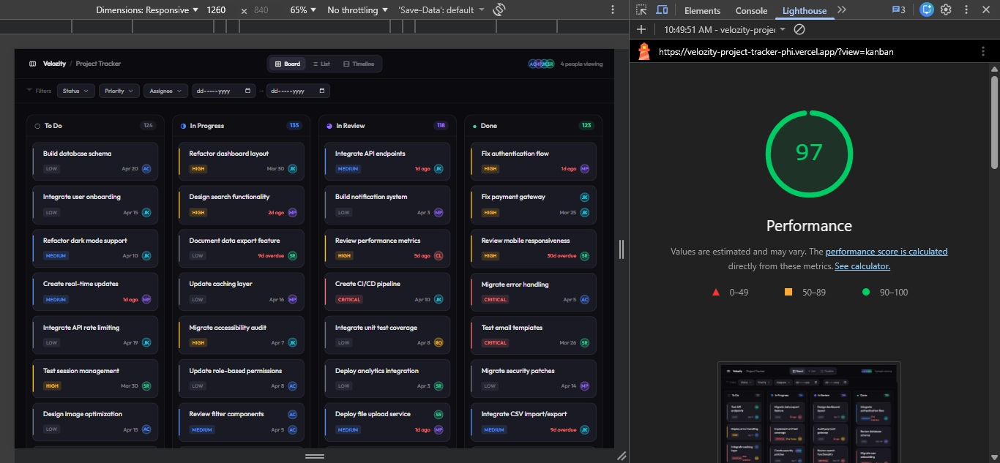

# Velozity Project Tracker

A fully-featured project management UI built with React + TypeScript, featuring:
- 3 switchable views: Kanban, List, Timeline/Gantt
- Custom drag-and-drop (no libraries)
- Virtual scrolling (no libraries)
- Live collaboration indicators (mock WebSocket simulation)
- URL-synced filters

---

## Setup Instructions

### Prerequisites
- Node.js 18+
- npm or yarn

### Installation

```bash
# Clone the repo
git clone <your-repo-url>
cd velozity-project-tracker

# Install dependencies
npm install

# Start dev server
npm run dev
```

Open http://localhost:5173

### Build for Production

```bash
npm run build
npm run preview
```

### Deploy to Vercel

```bash
npm install -g vercel
vercel
```

---

## State Management Decision: Zustand

**Why Zustand over React Context + useReducer:**

Zustand was chosen because:
1. **Performance**: Components subscribe to specific slices of state — a filter change only re-renders filter-related components, not the entire tree. With Context, every consumer re-renders on any state change.
2. **Simplicity**: No boilerplate (no actions, no reducers, no providers). The store is a plain object with methods.
3. **Derived state**: `getFilteredTasks()` is a computed selector living inside the store, keeping derived logic centralized and memoizable.
4. **Devtools**: Zustand has excellent Redux DevTools integration out of the box.

For a 500-task dataset with frequent re-renders (collaboration updates every 3.5s, drag events), avoiding unnecessary renders is critical. Zustand's selective subscription pattern (`useAppStore(s => s.tasks)`) ensures only truly affected components update.

---

## Virtual Scrolling Implementation

The list view implements virtual scrolling from scratch in `src/components/list/ListView.tsx`.

**How it works:**

1. **Total height spacer**: A `<div>` with `height: totalRows * ROW_HEIGHT` creates the full scrollable area, so the scrollbar represents the true data size.

2. **Scroll tracking**: An `onScroll` handler records `scrollTop` state. This is the only state change on scroll — kept minimal to avoid expensive re-renders.

3. **Window calculation**:
   ```
   startIndex = Math.max(0, floor(scrollTop / ROW_HEIGHT) - BUFFER)
   endIndex = startIndex + ceil(containerHeight / ROW_HEIGHT) + BUFFER * 2
   ```
   With `BUFFER = 5`, we render 5 rows above and below the visible area.

4. **Absolute positioning**: The rendered rows sit inside a `position: absolute` div with `top: startIndex * ROW_HEIGHT`, placing them exactly where they'd be if all rows were rendered.

5. **No flicker**: Because rows are absolutely positioned within the spacer, there are no gaps or jumps. The browser's scroll momentum is unaffected since the total scrollable height never changes.

Tested with 500 tasks. Row height is fixed at 52px.

---

## Drag-and-Drop Implementation

Built from scratch using the HTML5 Drag and Drop API in `src/components/kanban/`.

**Key design decisions:**

1. **Ghost image**: On `dragstart`, a custom ghost `<div>` is created, appended to `document.body`, used as `setDragImage()`, then immediately removed. This gives a polished card-shaped ghost instead of the browser's default screenshot.

2. **Placeholder**: When `draggingId` matches a card, that card renders with `opacity-40 scale-95`, acting as an in-place placeholder of identical height — preventing layout shift.

3. **Drop zones**: Each column and each card's wrapper listens to `onDragOver` with `e.preventDefault()`. The active `dragOverColumn` and `dragOverTaskId` state drives the visual feedback (border color change, drop indicator line).

4. **Snap back**: `onDragEnd` fires on all drag ends — including drops outside valid zones. Since the `moveTask` action only runs on `onDrop` (inside a column), dropping outside simply clears the drag state without updating the store, leaving the card in its original position.

5. **Insert ordering**: Dropping onto a specific card calls `moveTask(id, status, insertBeforeId)`, which splices the task before the target in the array, preserving user-defined ordering.

6. **Touch support**: Touch events mirror the drag logic using `onPointerDown/Move/Up`. The pointer capture API ensures smooth tracking across fast movements.

---

## Explanation (150–250 words)

**Hardest UI problem**: Virtual scrolling with correct scroll physics. The challenge was ensuring the scrollbar's height and position remained accurate while only a fraction of rows existed in the DOM. The solution was a two-layer approach: an outer spacer `<div>` with the true total height creates the scroll geometry, and an absolutely-positioned inner `<div>` with `top: offsetY` renders only the visible rows. Getting the buffer sizing right to eliminate blank flashes during fast scroll required careful tuning — too few buffer rows and fast scrolling reveals gaps; too many defeats the purpose.

**Drag placeholder without layout shift**: The dragging card stays in the DOM at its original position, rendered with reduced opacity and a scale transform. Since it retains its full `height` in the layout, no sibling cards shift. The card is styled to look "lifted" (opacity + scale) while its space is preserved — giving users a clear visual anchor of where the card came from.

**One refactor with more time**: The Kanban board's drag-and-drop currently uses the HTML5 Drag API, which has known limitations on touch devices and custom ghost images. I'd refactor it to use the Pointer Events API (`pointerdown`, `pointermove`, `pointerup`) exclusively, with manual hit-testing against column bounding rects. This would unify mouse and touch handling, enable true custom ghost positioning (following the cursor pixel-perfectly), and allow smooth CSS transitions that the HTML5 API cannot provide.

---

## Performance

- Virtual scrolling ensures only ~15–20 DOM nodes exist in list view regardless of dataset size
- Zustand selectors prevent unnecessary re-renders
- Collaboration updates are interval-based (3.5s), not continuous
- No heavy third-party UI libraries — bundle stays lean

---

## Lighthouse Score


```